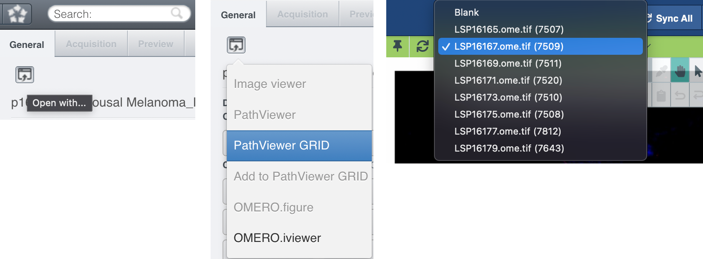

## Export from Pathviewer to Minerva

Here's how to export channel rendering settings from Pathviewer. First, login to O2 using your eCommons ID.

```
ECOMMONS_ID="abc123"
ssh $ECOMMONS_ID@o2.hms.harvard.edu
srun --pty -t 0-02:00 -p interactive bash
```

Now, login to `idp.tissue-atlas.org` with the same eCommons ID. Dont click "Continue." Instead, click "obtain a session token here". Use the token as follows:

```
module load omero
pip install omero-py
TOKEN="11111111-2222-3333-4444-555555555555"
omero login idp.tissue-atlas.org -u "$TOKEN" -w "$TOKEN"
```



Follow these steps to find the Image ID. If you have an Omero dataset ID, search `idp.tissue-atlas.org` for that ID. From the nav-bar dropdown menu, find the Image ID (in parenthesis) alongside the name of the image. Extract and convert the channel groups using the Image ID as below:

```
IMAGE_ID="12345"
cd omero_export
bash export_from_pathviewer.sh "$IMAGE_ID"
node convert_from_pathviewer.js "$IMAGE_ID"
```
